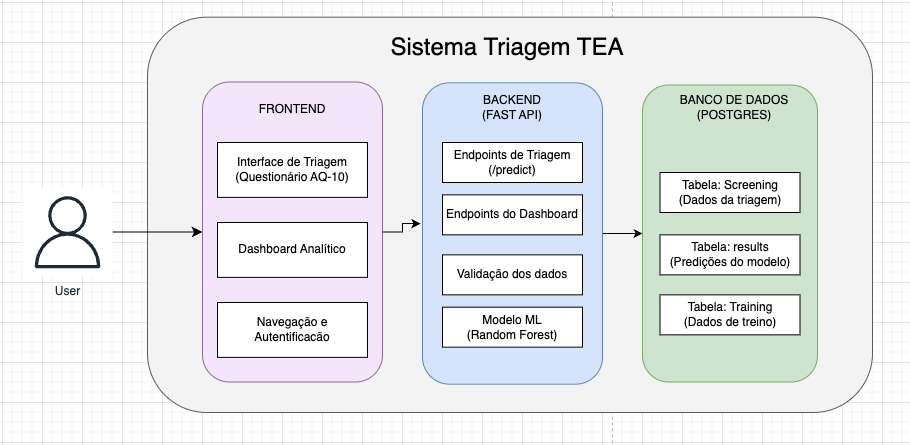

# Sistema_Triagem_TEA

# 🧠 Sistema de Triagem TEA (Transtorno do Espectro Autista)

Sistema completo de triagem inicial para TEA utilizando Machine Learning, com interface web responsiva e dashboard analítico para especialistas.

## 📋 Sobre o Projeto

Este sistema foi desenvolvido para auxiliar profissionais de saúde na triagem inicial de TEA através do questionário AQ-10 (Autism Spectrum Quotient). Utiliza um modelo de Machine Learning treinado com Random Forest para predição, alcançando alta acurácia na identificação de casos que necessitam avaliação especializada.

### Funcionalidades Principais

**Para Usuários:**
- Questionário AQ-10 interativo (10 perguntas)
- Coleta de informações demográficas
- Resultado imediato com nível de confiança
- Recomendações personalizadas baseadas no resultado

**Para Especialistas/Analistas:**
- Dashboard analítico com KPIs principais
- Visualizações de distribuição por idade e gênero
- Análise de fatores de risco (icterícia, histórico familiar)
- Timeline de triagens (últimos 30 dias)
- Análise detalhada dos scores por questão do AQ-10
- Taxa de positividade e métricas do modelo

## 🏗️ Arquitetura do Sistema



## 🔄 Fluxo da Aplicação

### 1. Fluxo de Triagem
```Usuário acessa frontend
↓
Preenche questionário AQ-10 (10 perguntas)
↓
Preenche informações demográficas (idade, gênero, etc)
↓
Frontend envia POST /predict para backend
↓
Backend salva dados na tabela "screenings"
↓
Modelo ML processa dados e faz predição
↓
Backend salva resultado na tabela "results"
↓
Backend retorna: predição + confiança + recomendação
↓
Frontend exibe resultado para o usuário
```

### 2. Fluxo do Dashboard
```
Especialista acessa dashboard (senha: admin123)
↓
Frontend faz múltiplas requisições GET:

/api/dashboard/kpis (estatísticas gerais)
/api/dashboard/age-distribution
/api/dashboard/gender-distribution
/api/dashboard/timeline
/api/dashboard/risk-factors
/api/dashboard/score-analysis
↓
Backend executa queries SQL no PostgreSQL
↓
Backend retorna dados agregados (JSON)
↓
Frontend renderiza gráficos interativos (Recharts)
```

## 🛠️ Tecnologias Utilizadas

### Backend
- **FastAPI** - Framework web moderno e de alta performance
- **SQLAlchemy** - ORM para PostgreSQL
- **Scikit-learn** - Modelo de Machine Learning (Random Forest)
- **Pydantic** - Validação de dados
- **Uvicorn** - Servidor ASGI

### Frontend
- **React** - Biblioteca JavaScript para interfaces
- **Recharts** - Visualização de dados
- **Lucide React** - Ícones
- **CSS3** - Estilização customizada

### Banco de Dados
- **PostgreSQL 15** - Banco de dados relacional

### Machine Learning
- **Random Forest Classifier** - Modelo otimizado


## 🚀 Instalação e Execução com Docker

### Pré-requisitos

- **Docker Desktop** (Windows/Mac) ou **Docker Engine** (Linux)
  - Download: https://www.docker.com/products/docker-desktop
- **Git**
  - Download: https://git-scm.com

### Passo a Passo

### 1. Clonar o Repositório

```bash
git clone https://github.com/seu-usuario/tea-screening-system.git
cd tea-screening-system
```
###  2. Iniciar a Aplicação
```bash
docker-compose up
```
Aguarde 2-3 minutos enquanto o Docker:

Baixa as imagens necessárias
Instala dependências do Python e Node.js
Inicia os serviços (PostgreSQL, Backend, Frontend)

### 3. Acessar a Aplicação
Quando aparecer a mensagem:
```
tea_backend  | INFO: Application startup complete.
tea_frontend | webpack compiled successfully
```
Acesse no navegador:
```
Frontend (Interface Principal): http://localhost:3000
Backend (API): http://localhost:8000
Documentação da API: http://localhost:8000/docs
```
### 4. Credenciais

#### Dashboard Analítico: Senha admin123


### Comandos Úteis 

```bash
# Parar a aplicação
docker-compose down

# Parar e remover dados do banco (recomeçar do zero)
docker-compose down -v

#Ver logs em tempo real
docker-compose logs -f

# Ver logs de um serviço específico
docker-compose logs -f backend
docker-compose logs -f frontend
docker-compose logs -f postgres

#Reiniciar apenas um serviço
docker-compose restart backend

#Rodar em background (sem logs no terminal)
docker-compose up -d

# Parar serviços em background
docker-compose down
```

## 📊 Estrutura do Projeto
```
tea-screening-system/
├── frontend/                    # Aplicação React
│   ├── src/
│   │   ├── App.js              # Componente principal (Triagem + Dashboard)
│   │   ├── App.css             # Estilos
│   │   └── index.js            # Entry point
│   ├── public/
│   ├── package.json
│   └── Dockerfile
│
├── backend/                     # API FastAPI
│   └── app/
│       ├── app.py              # Aplicação principal e endpoints
│       ├── database.py         # Configuração do banco
│       ├── schema.py           # Modelos SQLAlchemy
│       ├── classifier_tea.py   # Modelo de ML
│       ├── dashboard_endpoints.py  # Endpoints do dashboard
│       ├── scripts/
│       │   └── populate_training_data.py  # Script para popular banco
│       ├── models/
│       │   └── tea_model_optimized.pkl    # Modelo treinado
│       ├── requirements.txt
│       └── Dockerfile
│
├── data/
│   └── autism_screening.csv    # Dataset original
│
├── docker-compose.yml           # Orquestração dos serviços
├── init.sql                     # Script de inicialização do banco
└── README.md
```

## 📡 Endpoints da API

### Triagem


```http 
POST /predict
Content-Type: application/json
{
  "A1_Score": 1,
  "A2_Score": 0,
  "A10_Score": 1,
  "age": 25,
  "gender": "m",
  "jundice": "no",
  "autism": "no",
  "used_app_before": "no"
}
```

### Dashboard
```http
GET /api/dashboard/kpis
GET /api/dashboard/age-distribution
GET /api/dashboard/gender-distribution
GET /api/dashboard/timeline?days=30
GET /api/dashboard/risk-factors
GET /api/dashboard/score-analysis
```
### Utilitários
```http
GET /health
GET /stats
GET /recent-screenings?limit=10
```
#### Documentação completa: http://localhost:8000/docs


## ⚠️ Avisos Importantes

* Este sistema é uma ferramenta de triagem inicial e não substitui diagnóstico profissional.
* Os resultados devem ser interpretados por profissionais qualificados.
* Sempre consulte um especialista para avaliação completa.
* Dados sensíveis de saúde devem ser tratados com segurança e privacidade.

